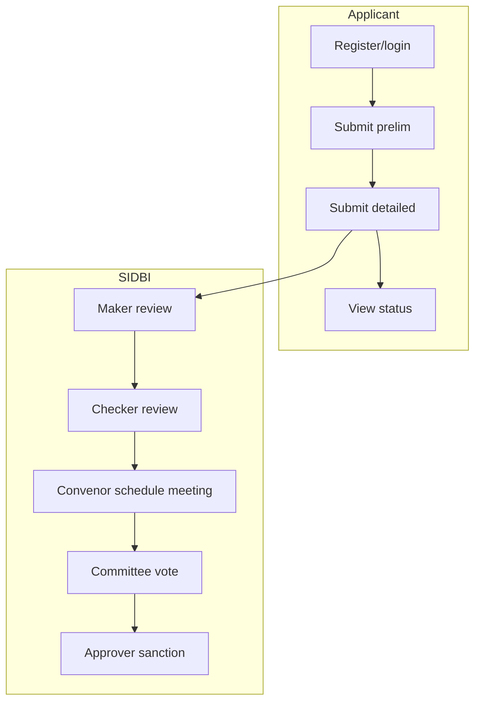

# Architecture & Developer Guide — SIDBI Venture Debt Platform

> This document expands on `DOCUMENTATION.md` with full architecture details, code walkthroughs, and flow diagrams.

---

## 1. Project Overview

This is a **frontend-first prototype** for a SIDBI venture-debt workflow. It provides:

- Applicant onboarding & registration
- Preliminary eligibility screening (`prelim`)
- Detailed application submission (`detailed`)
- SIDBI review workflows (maker/checker/convenor/committee/approver)
- Committee meeting scheduling + voting

Instead of a real backend, it uses a **mock backend** built with **RTK Query** + **`fakeBaseQuery`**, backed by **in-memory arrays + `localStorage`**.

---

## 2. Tech Stack & Tools

### Main Environment
- **Language**: TypeScript 
- **Framework**: React 18
- **Bundler/Dev Server**: Vite

### Build / Tooling
- **Vite** (fast dev server + build)
- **ESLint** + **TypeScript**
- **Vitest** for unit tests
- **Tailwind CSS** (with `tailwindcss-animate`)

### UI & Component Libraries
- **shadcn-ui** (Radix UI + Tailwind components)
- **Radix UI** (via shadcn)
- **Lucide React** (icons)
- **Recharts** (charts)

### State + Data
- **Redux Toolkit** (state + RTK Query)
- **RTK Query `fakeBaseQuery`** (mock API)
- **React Query (`@tanstack/react-query`)** (for async cache + query behavior)

### Forms + Validation
- **React Hook Form** (form state)
- **Zod** (validation schema)

### Styling
- Tailwind CSS + `tailwind-merge` + `class-variance-authority`

---

## 3. Repository Structure (File Architecture)

### Root files
- `package.json` — dependencies + scripts
- `vite.config.ts` — Vite config
- `tsconfig.json` / `tsconfig.app.json` — TypeScript config
- `tailwind.config.ts` — Tailwind config
- `public/application-fields.json` — canonical form schema (single source of truth for fields)

### Source (`src/`)

#### Entry
- `src/main.tsx` — app entrypoint
- `src/App.tsx` — routing & global providers (React Query, Tooltips, Toasts)

#### Routing / Pages
- `src/pages/` — top-level routes & pages:
  - `Index.tsx` — landing page
  - `Login.tsx` — login + demo accounts
  - `Register.tsx` — applicant registration
  - `ApplicantDashboard.tsx` — applicant home
  - `PrelimApplication.tsx` — prelim eligibility form
  - `DetailedApplication.tsx` — detailed app form
  - `ApplicationView.tsx` — read-only app view
  - `SidbiDashboard.tsx` — SIDBI dashboard
  - `SidbiApplicationReview.tsx` — SIDBI review panel
  - `CommitteeMeeting.tsx` — create/edit meeting
  - `CommitteeReview.tsx` — voting + committee decisions
  - `CommitteeMeetingsList.tsx` — meeting lists
  - `AdminRegistrations.tsx` — admin review of registrations
  - `NotFound.tsx` — catch-all route

#### UI Components
- `src/components/ui/` — shadcn-ui component wrappers (Button, Dialog, Input, Form, etc.)
- `src/components/layout/` — layout shells + headers/footers
- `src/components/GovStatusBadge.tsx` — status badges for workflow steps

#### State / Store / Mock Backend
- `src/store/api.ts` — RTK Query API (fake backend)
- `src/store/mockData.ts` — seed/mock data for the fake backend
- `src/store/index.ts` — Redux store setup

#### Business Logic / Domain
- `src/lib/authStore.ts` — localStorage session management
- `src/lib/registrationStore.ts` — localStorage registration persistence
- `src/lib/applicationStore.ts` — workflow state machine + application persistence
- `src/lib/meetingStore.ts` — meeting persistence + committee voting
- `src/lib/prelimConfig.ts` — prelim form configuration & field metadata

#### Hooks
- `src/hooks/use-toast.ts` — custom toast management (wrapper around shadcn toast)

---

## 4. State Management (Redux Toolkit + RTK Query)

### Redux Store (`src/store/index.ts`)

- Uses `configureStore` from Redux Toolkit
- Registers a single reducer: `api.reducer` (from RTK Query)
- Adds `api.middleware` to enable caching / invalidation
- Exports typed hooks: `useAppDispatch`, `useAppSelector`

```ts
export const store = configureStore({
  reducer: {
    [api.reducerPath]: api.reducer,
  },
  middleware: (getDefaultMiddleware) =>
    getDefaultMiddleware().concat(api.middleware),
});
```

### RTK Query API & Fake Backend (`src/store/api.ts`)

This file defines the entire backend surface for the app.
It uses:
- `createApi()`
- `fakeBaseQuery()` (so there is no real network)
- in-memory objects (`DB_APPLICATIONS`, `DB_REGISTRATIONS`, `DB_MEETINGS`, `DB_SESSION`)

It also defines a **state machine** for workflow transitions by reimplementing the same transition map used in `applicationStore.ts`, ensuring the API and client-side engine match.

The `api` exposes hooks such as:
- `useLoginMutation`, `useLogoutMutation`, `useGetSessionQuery`
- `useGetApplicationsQuery`, `useApplyWorkflowActionMutation`, etc.

### Local Persistence (localStorage)

In addition to the in-memory mock DB, the app persists state in `localStorage` so reloads maintain the demo state.

Key storage keys:
- `venture_debt_auth` → session data
- `venture_debt_registrations` → registrations
- `venture_debt_applications` → application state
- `venture_debt_meetings` → meeting state

The persistence is handled by helper modules:
- `src/lib/authStore.ts`
- `src/lib/registrationStore.ts`
- `src/lib/applicationStore.ts`
- `src/lib/meetingStore.ts`

---

## 5. Data Endpoints (API & DB)

### Mock API Endpoints (RTK Query)

These endpoints are exposed through `src/store/api.ts`.

#### Auth
- `login({ email, password })` (demo-only)
- `loginAsDemo({ email, userType, sidbiRole })` (helper for demo buttons)
- `logout()`
- `getSession()`

#### Registrations
- `getRegistrations()`
- `addRegistration(regData)`
- `updateRegistrationStatus({ id, status })`

#### Applications
- `getApplications({ email?, role? })` — list apps (filters by applicant or role)
- `getApplicationById(id)`
- `createPrelimApplication({ email, prelimData })` (creates a new application)
- `updatePrelimData({ id, prelimData })` (updates existing)
- `submitDetailedApplication({ appId, detailedData })` (submits detailed form)
- `applyWorkflowAction({ id, action, actor, ...opts })` (core workflow transitions)
- `deleteApplication(id)`

#### Meetings
- `getMeetings({ type? })`
- `getMeetingById(id)`
- `createMeeting(meetingData)`
- `updateMeetingStatus({ id, status, outcome? })`
- `addVote({ meetingId, vote })`

### “Database” (In-Memory + `localStorage`)

**Primary tables (arrays)**
- `DB_REGISTRATIONS: Registration[]`
- `DB_APPLICATIONS: Application[]`
- `DB_MEETINGS: CommitteeMeeting[]`
- `DB_SESSION: AuthSession | null`

**Seed data** is imported from `src/store/mockData.ts`, which defines:
- Several registrations (`mockRegistrations`)
- Several applications (`mockApplications`), including mixed workflow states
- A scheduled meeting with no votes yet (`mockMeetings`)

---

## 6. Core Application Architecture & Flow

### 6.1 High-level Flow (User Roles)

#### Applicant
1. Register (`/register`)
2. Login (`/login`)
3. Submit preliminary app (`/prelim-application`)
4. If approved, submit detailed app (`/detailed-application`)
5. View status and review feedback (`/application-view/:id`)

#### SIDBI (Maker / Checker / Convenor / Committee / Approver)
- Maker: review & approve prelim; review detailed; recommend ICVD/CCIC
- Checker: endorse/reject the maker decision; assign convenor; review notes
- Convenor: schedule meetings, invite committee members
- Committee: vote and recommend referral/rejection
- Approver: final sanction/rejection

### 6.2 Workflow State Machine (Core Logic)

The state machine is implemented in `src/lib/applicationStore.ts` and is reused in `src/store/api.ts`.

Key concepts:
- `WorkflowStep` enumerates all possible steps.
- `WorkflowAction` enumerates all possible actions.
- `workflowTransitions` defines valid actions for a given step.
- `actionTransitions` maps actions → next step.

Here’s the core logic for validating transitions:

```ts
export function isValidTransition(step: WorkflowStep, action: WorkflowAction): boolean {
  return (workflowTransitions[step] ?? []).includes(action);
}
```

And applying an action in `applyWorkflowAction()` updates:
- `workflowStep` (next state)
- `status` and `stage` (derived from action)
- `assignedChecker`, `assignedConvenor`, etc.
- `auditTrail` and global `comments`

### 6.3 Workflow Diagram (Mermaid)

```mermaid
flowchart TD
  A[Applicant submits prelim] -->|approve_prelim| B[Detailed application opens]
  B -->|recommend_pursual| C[Checker review (pursual)]
  B -->|recommend_rejection| D[Checker review (rejection)]
  C -->|recommend_icvd| E[ICVD maker review]
  C -->|recommend_ccic| F[CCIC maker review]
  E -->|icvd_maker_forward| G[ICVD checker review]
  G -->|icvd_checker_assign_convenor| H[ICVD convenor scheduling]
  H -->|icvd_schedule_meeting| I[ICVD committee review]
  I -->|icvd_committee_refer| F[CCIC maker review]
  F -->|ccic_maker_upload| J[CCIC checker review]
  J -->|ccic_checker_assign_convenor| K[CCIC convenor scheduling]
  K -->|ccic_schedule_meeting| L[CCIC committee review]
  L -->|ccic_committee_refer| M[Final approval]
  M -->|approve_sanction| N[Sanctioned]
```

### 6.4 Use Case Flow (Simplified)



---

## 7. Detailed File Purpose + Core File Walkthrough

### 7.1 `src/App.tsx` — App Shell + Routing

- Sets up `QueryClientProvider` for React Query
- Wraps UI in `TooltipProvider`, toast components (`Toaster` and `Sonner`)
- Configures client-side routes via React Router

> Example: routing is stateless and purely based on URL. If you need permissions, implement a wrapper/HOC (not currently present).


### 7.2 `src/store/api.ts` — Mock API + RTK Query Endpoints

This is the most important file for understanding how the app behaves.

It uses an in-memory store and provides request-level operations that the UI consumes via hooks.

Key parts:

#### 7.2.1 In-memory “DB”
```ts
let DB_REGISTRATIONS: Registration[] = [...mockRegistrations];
let DB_APPLICATIONS: Application[] = [...mockApplications];
let DB_MEETINGS: CommitteeMeeting[] = [...mockMeetings];
let DB_SESSION: AuthSession | null = null;
```

#### 7.2.2 Auth endpoints (session + demo login)

```ts
login: builder.mutation<AuthSession, { email: string; password: string }>(...)
loginAsDemo: builder.mutation<AuthSession, { email: string; userType: UserType; sidbiRole?: SidbiRole }>(...)
logout: builder.mutation<void, void>(...)
getSession: builder.query<AuthSession | null, void>(...)
```

#### 7.2.3 Application endpoints

- `createPrelimApplication` → creates new application record
- `submitDetailedApplication` → moves application to `detailed_maker_review`
- `applyWorkflowAction` → core state transition logic (calls `isValidTransition()` and updates workflow step + status)

Snippet:

```ts
if (!isValidTransition(app.workflowStep, action)) {
  return { data: { success: false, error: `Invalid transition: "${action}" from "${app.workflowStep}".` } };
}

const nextStep = actionTransitions[action];
app.workflowStep = nextStep;

// derive status/stage
deriveStatusAndStage(app, action);

// audit trail
app.auditTrail.push({ actorRole: actor.role, actorId: actor.id, actionType: action, remark: comment ?? "", timestamp: new Date().toISOString(), });
```

#### 7.2.4 Meetings endpoints

- Meetings are created & stored in `DB_MEETINGS`
- Votes are appended to the meeting's `votes` array
- Status updates create outcomes (`referred`, `rejected`)

---

### 7.3 `src/lib/applicationStore.ts` — Workflow Engine + Persistence

This file is the *single source of truth* for state transitions.

Key exports:
- `WorkflowStep`, `WorkflowAction`, `AppStatus`, `AppStage`
- `workflowTransitions` (allowed actions per step)
- `isValidTransition(step, action)`
- Persistence helpers: `getApplications()`, `getApplicationById()`, `createPrelimApplication()`, `applyWorkflowAction()`

**Important patterns**:
- Legacy backfill logic (for older records missing `workflowStep` or `auditTrail`)
- `applyWorkflowAction()` uses `options` to store assignments + meeting IDs
- `updateApplicationStatus()` exists to support legacy status-based updates (pre-`applyWorkflowAction`)

---

### 7.4 `src/lib/meetingStore.ts` — Meetings + Voting

Defines:
- `CommitteeMeeting`, `CommitteeMember`, `MeetingVote` types
- `getMeetings*`, `createMeeting`, `updateMeetingStatus`, `addVoteToMeeting`

Includes a **committee member pool** (static) used to populate member lists.

---

### 7.5 `src/lib/authStore.ts` — Session Persistence

Simple `localStorage` storage with:
- `getSession()`
- `setSession(session)`
- `clearSession()`

Used by pages to determine current user and ensure flows render correctly.

---

## 8. Pages & Core Components (Detailed)

Below are the “core” pages and components that drive the platform.

### 8.1 `src/pages/Register.tsx` (Applicant Registration)

- Uses `react-hook-form` + Zod schema for validation
- Sends data to `useAddRegistrationMutation()` (mock API)
- Uses `PublicLayout` (page shell)
- Stores registration data in the mock backend, then shows a toast

Key snippet (Zod schema + submission):

```ts
const registerSchema = z.object({
  email: z.string().email("Please enter a valid email address"),
  phoneNumber: z.string().regex(/^[0-9]{10}$/, "Phone number must be exactly 10 digits"),
  password: z.string().min(8)...
  // ...
});

async function onSubmit(data: RegisterFormValues) {
  await addRegistration({
    email: data.email,
    nameOfApplicant: data.nameOfApplicant,
    // ...
  });
  toast({ title: "Registration Submitted", description: "Your application has been submitted for admin review." });
  form.reset();
}
```

### 8.2 `src/pages/PrelimApplication.tsx` (Preliminary Application)

This is one of the most complex pages:
- Supports modes: `fill`, `edit`, `view`
- Uses `prelimConfig.ts` to generate eligibility toggles + document upload slots
- Validates that all eligibility toggles are true before allowing submission
- Uses `useCreatePrelimApplicationMutation()` / `useUpdatePrelimDataMutation()`
- Shows SIDBI reviewer comment when in view mode

Key modes:
- `fill`: new application
- `edit`: revision after SIDBI revert
- `view`: read-only application view

### 8.3 `src/pages/Login.tsx` (Login + Demo Accounts)

Not shown in read results yet, but it is the “gateway” where the app sets session via the mock API and then routes user to the correct dashboard based on role.

### 8.4 Dashboard / Review Pages

Pages in `src/pages/` implement role-based flows (applicant vs SIDBI vs admin). Example:
- `ApplicantDashboard.tsx` shows user’s applications and next steps.
- `SidbiDashboard.tsx` lists apps assigned to the role (maker/checker/convenor etc.)
- `SidbiApplicationReview.tsx` displays application and provides workflow action buttons.
- Meeting-related UI is in `CommitteeMeeting.tsx`, `CommitteeReview.tsx`, `CommitteeMeetingsList.tsx`.

### 8.5 Layout / Shared Components

#### `src/components/layout/AppLayout.tsx`

- Provides the internal layout for SIDBI pages
- Includes `GovInternalHeader` and `GovFooter`
- Renders a breadcrumb/back bar when `breadcrumbs` or `backTo` are provided

#### `src/components/GovStatusBadge.tsx`

- Renders a badge based on `status`/`stage`/`workflowStep`.
- Has config mapping statuses to labels + color classes.

#### Toast + Notifications

- `src/hooks/use-toast.ts` provides a small global toast manager.
- Provides a function `toast({ title, description, variant })` used across the app.

---

## 9. User Management (Roles + Flow)

### Roles
- `applicant` — creates applications, views status, responds to reverts
- `sidbi` (with subrole) — performs reviews based on role:
  - `maker` — approve/reject prelim, create recommendations
  - `checker` — second-level review, assign convenor
  - `convenor` — schedule committee meetings
  - `committee_member` — vote in meetings
  - `approving_authority` — final sanction/ rejection
- `admin` — reviews registrations (not applications)

### Demo Accounts (defined in `src/store/api.ts`)

| Email | Role | Notes |
|------|------|-------|
| `applicant@demo.com` | applicant | starter applicant | 
| `sidbi-maker@demo.com` | sidbi (maker) |  |
| `sidbi-checker@demo.com` | sidbi (checker) |  |
| `sidbi-convenor@demo.com` | sidbi (convenor) |  |
| `sidbi-committee@demo.com` | sidbi (committee_member) |  |
| `sidbi-approving@demo.com` | sidbi (approving_authority) |  |
| `admin@demo.com` | admin | registration review |

### Access rules
- There is no explicit router-guarding; the app relies on UI logic and path selection.
- Pages can still be visited by URL, but UI components typically hide actions if session role does not match.

---

## 10. Deployment Status + How to Deploy

### Current status
- This repo is a frontend prototype.
- There is **no production backend**; all API calls are mocked.
- State persists in `localStorage`, meaning it’s not shareable between users.

### Local development

```bash
npm install
npm run dev
```

### Build for production

```bash
npm run build
```

A production build outputs to `dist/` by default.

### Suggested real-backend migration path

1. Replace `fakeBaseQuery()` in `src/store/api.ts` with `fetchBaseQuery({ baseUrl })`
2. Keep endpoint names & return shapes consistent
3. Implement auth token storage (or use JWT)
4. Replace localStorage persistence in `src/lib/*` with real API calls (or sync methods to backend)

---

## 11. Development Workflow

### Scripts (from `package.json`)

- `npm run dev` — start dev server
- `npm run build` — production build
- `npm run build:dev` — build in development mode
- `npm run lint` — run ESLint
- `npm run test` — run Vitest
- `npm run test:watch` — watch tests

### Coding Conventions
- Uses `src/` alias `@/` configured by Vite (see `tsconfig.json` / `vite.config.ts`)
- UI uses Tailwind + `cn()` utility (from `src/lib/utils.ts` likely)
- Components are split by responsibility (layout vs domain pages)

---

## 12. Where to Find Key Logic (Quick Reference)

| Topic | File(s) |
|------|---------|
| Routing | `src/App.tsx` |
| Mock Backend | `src/store/api.ts` |
| Seed Data | `src/store/mockData.ts` |
| Workflow engine | `src/lib/applicationStore.ts` |
| Meeting engine | `src/lib/meetingStore.ts` |
| Session storage | `src/lib/authStore.ts` |
| Registration persistence | `src/lib/registrationStore.ts` |
| Prelim form config | `src/lib/prelimConfig.ts` |
| Form library | `src/components/ui/form.tsx` (shadcn wrapper) |
| Status badges | `src/components/GovStatusBadge.tsx` |

---

## 13. Recommended Next Improvements (Optional)

- Add route guards (role-based protection + redirect to login)
- Add real authentication + backend API
- Add unit/integration tests for workflow transitions
- Add coverage for `applyWorkflowAction` state machine
- Add proper file upload storage (currently file fields are only string placeholders)

---

If you’d like, I can also generate a **visual architecture diagram** (SVG/PNG) based on these flows, and I can also produce a **Role Access Matrix** describing which pages/actions each role can perform.
